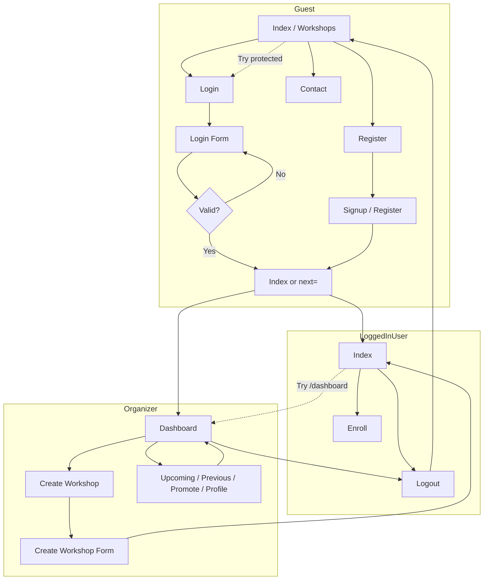

# Session-Based Navigation & UI Flow

## 1. Session Structure Definition

Session keys are stored server-side (Django sessions). No third-party auth.

| Key | Type | When set | Purpose |
|-----|------|----------|---------|
| `user_id` | int | On login/signup | Primary user PK (WhatsNextUsers.id) |
| `user_name` | str | On login/signup | Display name for welcome messages |
| `user_role` | str | On login/signup | `"user"` or `"organizer"` |
| `organizer_id` | int \| None | On login/signup when role=organizer | WhatsNextOrganizers.id for organizer-only views |

**Conceptual mapping for UI:**

- **session.user** (in templates: `session_user`) — Present when any user is logged in.  
  `session_user = { "id", "name", "role" }` or `None` for guests.
- **session.organizer** (in templates: `is_organizer`) — `True` when `user_role == "organizer"` and session has user data.

Session is cleared on logout (`request.session.flush()`).

---

## 2. User States & Behavior

| State | Condition | Shown in UI | Hidden in UI |
|-------|-----------|-------------|--------------|
| **Guest** | No `user_id` in session | List of workshops, Login, Register | Create Workshop, User dashboard, Organizer actions |
| **User** | `session_user` set, `user_role == "user"` | List of workshops, optional welcome, Logout | Login, Register, Create Workshop, Dashboard, Organizer-only actions |
| **Organizer** | `session_user` set, `user_role == "organizer"` | Welcome “Welcome, {name}”, Create Workshop, Dashboard, Logout | Login, Register |

---

## 3. Conditional UI Rendering (Templates)

All pages that use the shared header get `session_user` and `is_organizer` from the context processor `version1.context_processors.session_context`.

**Pseudocode for nav:**

```django

  {# Guest #}
  Show: Home, Register, Login, Contact

  {# Logged-in #}
  Show: Home
  
    Show: Create Workshop, Dashboard
  
  Show: Logout, Contact

```

**Welcome message:**

- **Index:** If `session_user`: show “Welcome, {name}!” for organizers, “Hi, {name}!” for users.
- **Organizer dashboard:** “Welcome, {session_user.name}!”

---

## 4. Navigation & Page Flow

| Link / Action | Route name | Access |
|---------------|------------|--------|
| Home | `index` | Public |
| Register | `register_workshop` | Public |
| Login | `login` | Public |
| Logout | `logout` | Any (clears session) |
| Create Workshop | `create_workshop` | Organizer only |
| Dashboard | `organizer_dashboard` | Organizer only |
| Dashboard → Add Workshop | `add_workshop` → redirects to `create_workshop` | Organizer only |
| Dashboard → Upcoming / Previous / Promote / Profile | `upcoming_workshops`, etc. | Organizer only |
| Enroll | `enroll_workshop`, `confirm_enroll` | Public |

All organizer-only views are protected with the `@organizer_required` decorator (see below).

---

## 5. Backend Guards (Security)

**Decorators** (`version1.decorators`):

1. **`@organizer_required`**
   - If no `user_id` in session → redirect to **Login** with `?next=<current path>`.
   - If `user_role != "organizer"` → redirect to **index** with error message.
   - Used on: `create_workshop_view`, `organizer_dashboard`, `add_workshop`, `upcoming_workshops`, `previous_workshops`, `promote_workshop`, `organizer_profile`.

2. **Login redirect**
   - After successful login, if `request.GET.get('next')` is a safe path (starts with `/`), redirect there; otherwise redirect to **index**.

**Session validation:**

- No JWT or API keys; state is entirely in server-side session.
- Guards run on every request to protected views; no role is inferred from client-only data.
- Organizer actions (e.g. creating a workshop) resolve the organizer from `request.session['user_id']` and `WhatsNextOrganizers.objects.get(user_id=...)` so only a valid organizer can create workshops.

---

## 6. Navigation Flow Diagram (Mermaid)



---

## 7. Sample Implementation References

- **Context processor:** `version1/context_processors.py` → `session_context(request)`.
- **Decorators:** `version1/decorators.py` → `login_required`, `organizer_required`.
- **Views:** `version1/views.py` — session keys set in `login_view` and `signup_view`; organizer views decorated with `@organizer_required`.
- **Templates:** `version1/templates/index.html`, `version1/templates/base.html` — conditional nav and welcome using `session_user` and `is_organizer`.
- **Settings:** `LOGIN_URL = '/login/'` in `workshops/settings.py`; `version1.context_processors.session_context` added to `TEMPLATES['OPTIONS']['context_processors']`.
